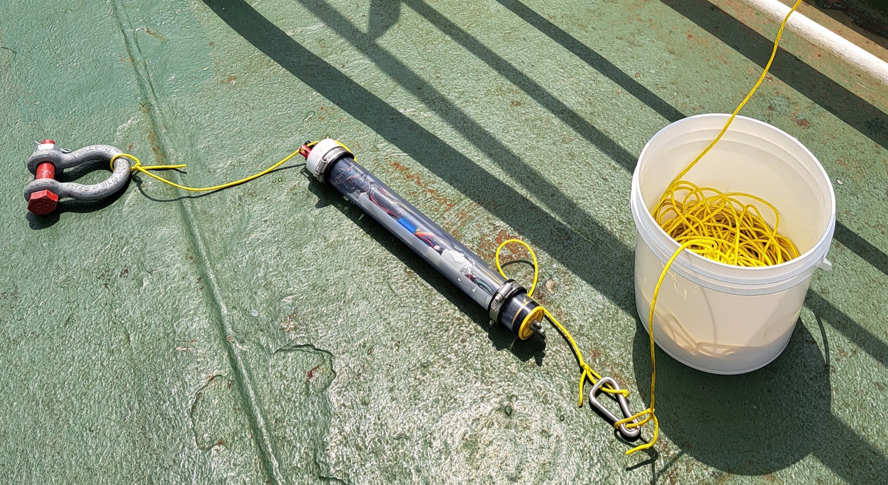
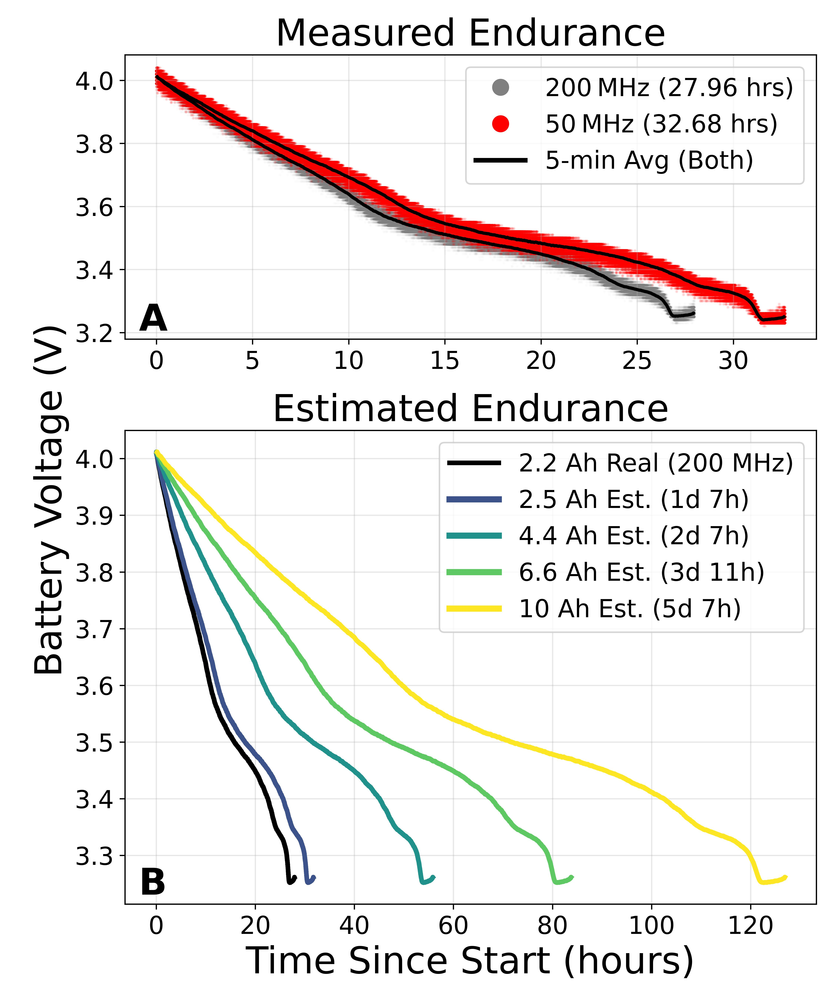
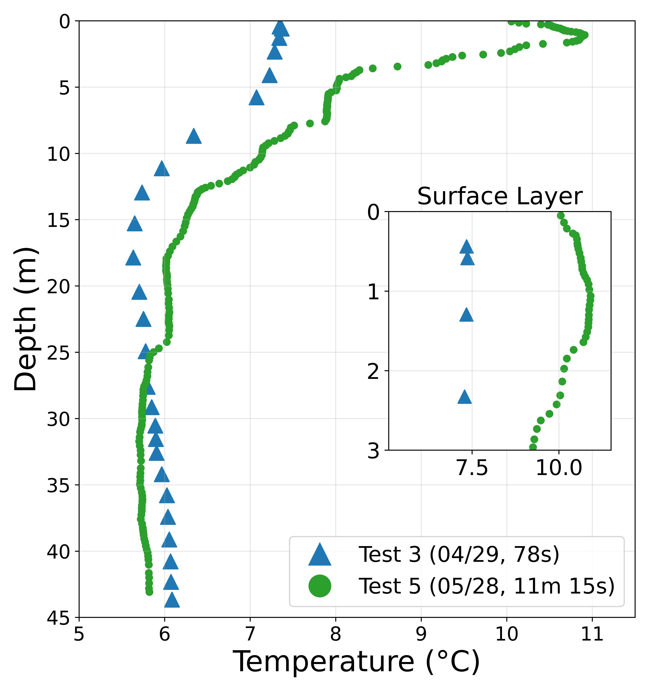
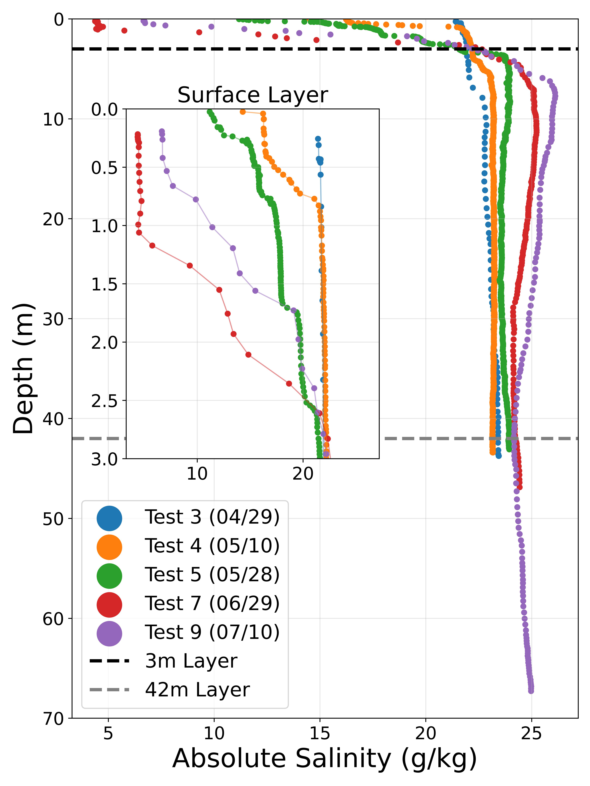
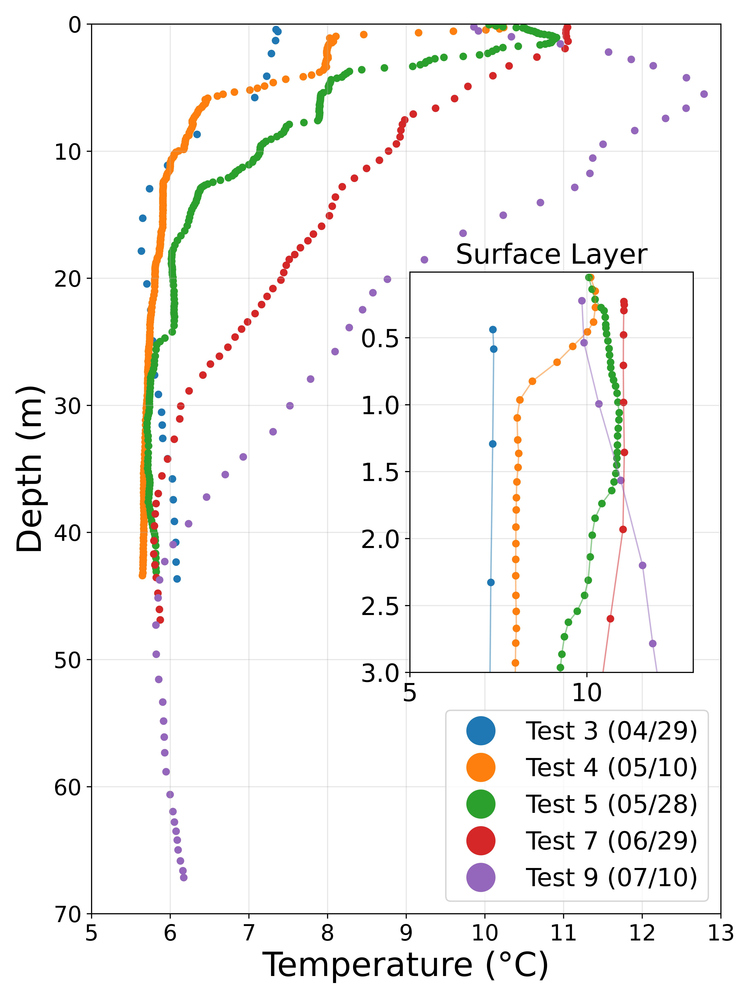
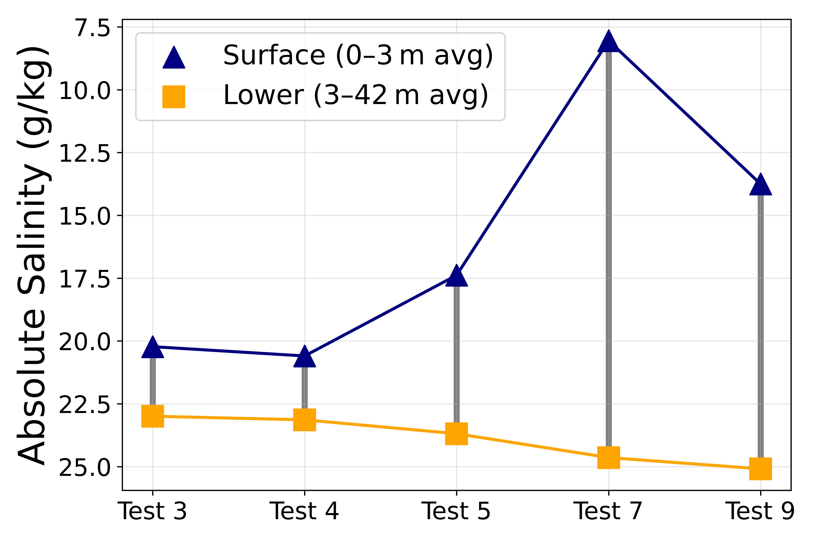
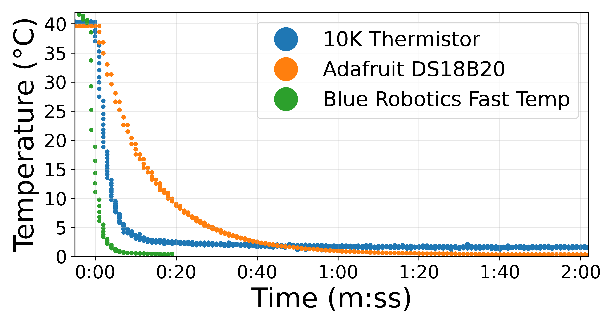
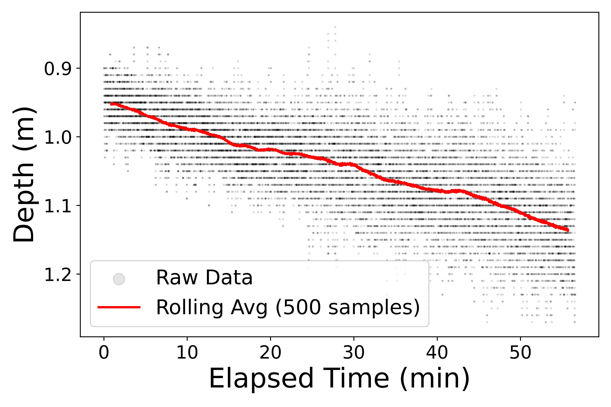
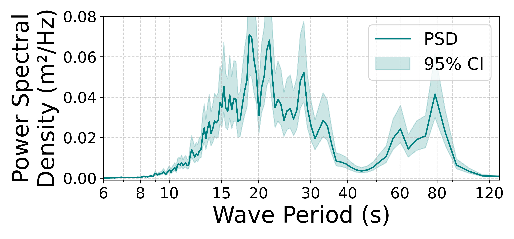

# SeaLabCTD MTS Paper Deployments and Figures

This folder contains plots, results, and analysis scripts from the series SeaLabCTD tests conducted April to July 2025 conducted immitely offshore the Valdez Marine Termina, in Port Valdez, Prince William Sound, Alaska. Each folder represents a different deployment.

--

### Tools Used
- Python (pandas, matplotlib, numpy, scipy, etc.)
- GSW (Gibbs SeaWater) Oceanographic Toolbox
- Arduino + Feather RP2040 Logger Firmware (see manual)
- Atlas Scientific + Blue Robotics sensors
---

### Notes
- All data is timestamped ISO 8601 format with "-" substituted for ":" for filename restrictions.
- `.csv` files in each directory contain "cleaned" data (only the relevent downcast). Sometimes there are two downcasts.
- The figures below are in the MTS paper.
---

### Contact

For questions, please ask Sophie Scopazzi. Contact information on [my website](https://www.sophiescopazzi.com/)

---

### Figures Overview

All figures used in MTS paper. All figures are located in their respective test folders. Alt text is provided for accessibility.

| Figure | Description |
|--------|-------------|
|  **Hand Deployment** | Method used to lower the CTD. A shackle is used as weight; a bucket prevents line tangling. |
|  **Battery Endurance** | Runtime comparison at 200 MHz vs 50 MHz. Estimation of endurance for different Adafruit batteries. |
|  **Lowering Speed Comparison** | Slow (6.4 cm/s) vs fast (52 cm/s) lowering shows how descent rate affects data fidelity. |
|  **Salinity Over Time** | Progressive surface freshening and salinity increase at depth across seasons. |
|  **Temperature Over Time** | Strong surface warming trend towards summer. Slower casts resolve gradients better. |
|  **Temperature–Salinity (T/S) Diagram** | July water is warmer and saltier. Broader curve shows stronger stratification. |
|  **Stratification Summary** | Difference between surface and bottom salinity increases over time. |
|  **Sensor Response Times** | Response curves from 40 °C then plunge to ice water. Fastest: Blue Robotics Fast Response TSYS01. |
|  **Tide Rise Time Series** | Static deployment shows incoming tide trend via pressure change. |
|  **Power Spectral Density (PSD)** | Frequency-domain plot of wave-related motion captured with pressure sensor. |